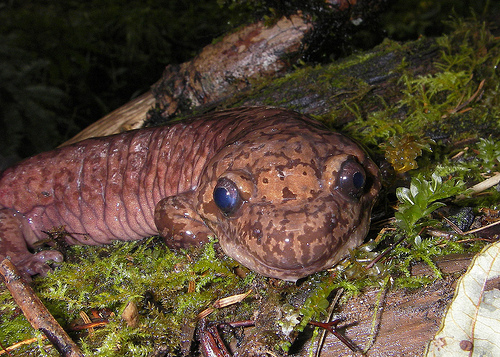

### Introduction

The Pacific Giant Salamander, Dicamptodon tenebrosus, is native to the Pacific Northwest of the United States, ranging from Northern California to Southern British Columbia (Gonder 1999).  The size, weight, and distribution of Giant Salamanders, as well as salmonid species, have been studied in order to understand the effects of land use changes in the Andrews Experimental Forest on the Western slope of the Cascade Mountain range in Oregon (HJ Andrews Experimental Forest LTER 2011).  Beginning in 1993, Gregory S. V. and Andrews Forest LTER started to model salamander population size and population distribution, as well as individual characteristics such as length and weight.  With accurate, long term data regarding these variables amongst the Pacific Giant Salamander, we can examine trends in population health and preference based on forest type and land use, as well as stream habitat classification (Gregory S. V. 2016).  In this report, we used data collected by the Andrews Forest LTER Site to compare Pacific Giant Salamander population characteristics across old growth and clear cut forests, as well as more specific habitat classification, specifically cascades, pools, and stream side channels.


**Figure 1**: Pacific Giant Salamander (Dicamptodon tenebrosus).  Credit: [Oregon Wild](https://oregonwild.org/wildlife/pacific-giant-salamander
)


### Data and Methods

Data for Pacific Giant Salamander population numbers and individual sizes were collected by annual survey of aquatic vertebrates in Andrews Experimental Forest, Oregon by the [Andrews Forest LTER Site](https://andrewsforest.oregonstate.edu/).  Forest section type (OC and CC) and channel unit classification type (Pool, Cascade, and Side Channel), were defined by specific characteristics of each location.  For more information on data and collection methods, see [metadata](https://portal.edirepository.org/nis/metadataviewer?packageid=knb-lter-and.4027.12).  Salamander counts from 1987-2017 were compared between Old Growth and Clear Cut forests.  Giant Salamander spatial trends across three channel types (Cascade, Pool, and Side channel) were compared between Old Growth and Clear Cut forests to identify, if any, a relationship between section of forest and channel type.  Trends in this relationship were compared by Chi-squared test at a 95% confidence interval.

This analysis was performed in Rstudio version 1.2.1335 running R version 3.6.1. The following packages were used in this report:

- tidyverse, version 1.2.1
- janitor, version 1.2.0
- effsize, version 0.7.6
- kableExtra, version 1.1.0
- ggridges, version 0.5.1

```{r setup, include=FALSE}
knitr::opts_chunk$set(echo = FALSE, message = FALSE, warning = FALSE)
```

```{r, include=FALSE}
# Attaching packages
library(tidyverse)
library(janitor)
library(kableExtra)
library(effsize)
library(ggridges)
```

```{r}
# Reading in data, cleaning names, and making our data frame correspond to only salamander observations
vertebrates <- read_csv("mack_creek_vertebrates.csv") %>% 
  clean_names() %>% 
  filter(species == "DITE")
```

### Results

#### Temporal Trends in Abundance (1993-2017)
First, we examined how the population of Pacific Giant Salamanders studied had changed throughout the course of the study. Specifically, we wanted to visually check if the condition of the forest in which they lived (old growth vs clear cut) had a clear influence on the overall abundance of salamanders. We created a plot of two timeseries of total number of salamanders counted in each of the sections between 1993 and 2017 (the years salamanders were observed), shown below in Figure 2.
```{r}
# Find total annual counts for two different sections of Mack Creek
vertebrates_section <- vertebrates %>% 
  select(year, section) %>% 
  group_by(year, section) %>% 
  count(section) %>% 
  mutate(
    sectionname = case_when(
      section == 'CC' ~ 'Clear Cut',
      section == 'OG' ~ 'Old Growth'
    )
  )
```
```{r}
# Plot changes in counts over time for both sections
ggplot(data = vertebrates_section, aes(x = year, y = n, color = sectionname)) +
  geom_line(show.legend = T) +
  geom_point(show.legend = FALSE) +
  theme_bw() +
  scale_x_continuous(expand = c(0.1,0),
                     breaks = seq(1990,2020,5)) +
  scale_y_continuous(expand = c(0.1,0),
                     limits = c(0,400)) +
  labs(x = "Year",
       y = "Salamander Count",
       title = "Pacific Giant Salamanders observed in different forest sections, 1993-2017",
       color = 'Forest Section') 
```
**Figure 2: Abundance of Pacific Giant Salamanders over time in each of the two forest type designations, 1987-2017.** *The red line represents the number of salamanders observed in clear cut sections of forest, whereas the blue line represents the number of salamanders observed in old growth forest.*

Examining the plot above, it becomes apparent that the two populations have displayed similar behavior over time. The movement in one roughly mirrors that of the other (see 2001-2007 for a good example of this). Both populations display the same general trend upwards, and neither is consistently greater than the other. We can also see that, in 2017, both populations have fairly similar abundance - `r vertebrates_section$n[49]` were recorded in the clear cut and `r vertebrates_section$n[50]` in the old growth. This brought us to the next step of our investigation: how forest conditions might influence where in the channel salamanders live. 

#### Spatial Trends in Salamander Abundance (2017)
To begin, we first created a table of the counts of salamanders found in three distinct channel areas designated by this study. We excluded 'isolated pool' salamanders to control solely for salamanders found in-stream. The table of counts and the proportion of observations in that type of forest section that the count in that channel area represents can be found below in Figure 3. 

**Figure 3: Number and proportion of Giant Salamander observations in 2017 by location.** *For each combination of forest section and channel classification, whole numbers indicate the number of salamanders observed there, and percentages indicate the proportion of salamanders observed in that forest section that the whole number represents.*
```{r}
# Filtering for salamanders observed in channel in the year 2017, and then grouping by OG and CC sections. 
vertebrates_count <- vertebrates %>%
  select(year, section, unittype) %>% 
  filter(year == "2017", unittype %in% c("C", "P", "SC")) %>% 
  count(unittype, section) %>% 
  pivot_wider(names_from = unittype, values_from = n) %>% 
  adorn_percentages(denominator = "row") %>% 
  adorn_pct_formatting(digits = 0) %>% 
  adorn_ns(position = "front") %>% 
  mutate(
    section = case_when(
      section == 'CC' ~ 'Clear Cut',
      section == 'OG' ~ 'Old Growth'
    )
  ) 
# Taking the results of our filtering and grouping above and displaying them within a Kable table along with the proportions we adorned them with above.
vertebrates_count %>%
  kable(col.names = c("Forest Section", "Cascade", "Pool", "Side Channel")) %>% 
  column_spec(c(1), border_right = T, bold = c(T)) %>%
  add_header_above(c(" " = 1, "Channel Classification" = 3)) %>% 
  add_header_above(c("Salamander Observations by Location" = 4),
                   bold = T,
                   color = 'white',
                   background = 'grey') %>% 
  kable_styling()
```
```{r}
# Doing the same filtering and grouping as above, minus the porportion adorning, and then performing a Chi-squared test at the 95% confidence level and storing the results as 'vert_chi_test'
vertebrates_chi <- vertebrates %>%
  select(year, section, unittype) %>% 
  filter(year == "2017", unittype %in% c("C", "P", "SC")) %>% 
  count(unittype, section) %>% 
  pivot_wider(names_from = unittype, values_from = n) %>% 
  select(-section)

vert_chi_test <- chisq.test(vertebrates_chi)
```
Examining the table above, both forest sections show roughly similar breakdowns of salamanders observed. The majority were found in cascades, followed by side channels and lastly within pools. In the old growth section, proportionally and numerically more salamanders were found in pools and less in cascades and side channels. However, proportions were still fairly similar for both, as the biggest difference was 6% between pool observations.

In order to assess this slight yet apparent difference statistically, we conducted a Chi-Squared Test at the 95% confidence level. Interestingly, we found that there was no statisitically significant effect of forest section on salamander location within the river channel ($\chi^2$(`r vert_chi_test$parameter[1]`) = `r round(vert_chi_test$statistic[1],3)`, *p* = `r round(vert_chi_test$p.value[1],3)`). Considering the definition of a p-value, we can say that there is an approximately 6.3% chance that we recorded this distribution of salamanders within the channel if the populations were in fact identically distributed between forest section. This is a slim chance, yet still statistically insignificant nonetheless, and the lack of statistical significance perhaps reflects of how small that difference appeared to be at first glance.   

#### Spatial Trends in Salamander Weight (2017)
```{r}
# Grouping the observations of the weights of the salamanders observed in 2017 by forest section, and storing the results in vectors 
vertebrates_weights <- vertebrates %>% 
  filter(year == "2017", unittype %in% c("C", "P", "SC")) %>% 
  select(weight, section, unittype) 

OG_weights <- vertebrates_weights %>% 
  filter(section == 'OG') %>% 
  select(weight)
OG_wts_vec <- OG_weights$weight
n_OG <- length(OG_wts_vec)

CC_weights <- vertebrates_weights %>% 
  filter(section == 'CC') %>% 
  select(weight)
CC_wts_vec <- CC_weights$weight
n_CC <- length(CC_wts_vec)

# Running a t test and a Mann-Whitney U test on the samples of weights and calculating Cohen's D.
weights_man_w <- wilcox.test(OG_wts_vec, CC_wts_vec)
weights_t <- t.test(OG_wts_vec, CC_wts_vec)
weights_d <- cohen.d(OG_wts_vec, CC_wts_vec)

# Uncomment these lines below to view the shape of the data
# ggplot(data = OG_weights, aes(x = weight)) +
#   geom_histogram()
# ggplot(data = CC_weights, aes(x = weight)) +
#   geom_histogram()
```
We then turned to salamander weight to assess how the populations might be different in different forest conditions. We conducted a t-test at the 95% confidence level, and found that there was no statistically significant difference in mean weights of salamanders between the sections ((*t*(`r round(weights_t$parameter[1],1)`) = `r round(weights_t$statistic[1],3)`, *p* = `r round(weights_t$p.value[1],3)`, n = `r n_OG` for old growth and `r n_CC` for clear cut)). 

Combined with the results of our Chi-Squared test above, we do not appear to have found any evidence for the effect that forest type may have on salamander populations, both in their abundance and mean weight.
```{r}
# Wrangling the data for display in results E and calculating and storing some sample statistics
C_weights <- vertebrates_weights %>%
  filter(unittype == 'C') %>%
  select(weight)
c_wts_vec <- C_weights$weight
c_wts_vec <- c_wts_vec[!is.na(c_wts_vec)]

P_weights <- vertebrates_weights %>%
  filter(unittype == 'P') %>%
  select(weight)
p_wts_vec <- P_weights$weight
p_wts_vec <- p_wts_vec[!is.na(p_wts_vec)]


SC_weights <- vertebrates_weights %>%
  filter(unittype == 'SC') %>%
  select(weight)
sc_wts_vec <- SC_weights$weight
sc_wts_vec <- sc_wts_vec[!is.na(sc_wts_vec)]

weights <- vertebrates_weights %>% 
  select(-section) %>% 
  group_by(unittype)

weights_summary <- weights %>% 
  summarize(mean_weight = mean(weight, na.rm = TRUE),
            median_weight = median(weight, na.rm = TRUE),
            sd_weight = sd(weight, na.rm = TRUE),
            sample_size = n(),
            se_weight = sd((weight) / sqrt(n()), (na.rm = TRUE)),
            var_weight = var(weight, na.rm = TRUE))
```
Next, we moved on to an examination of how location within the river channel might influence salamander weight. We first created a ridgeline plot of the distribution of salamander weights based on channel location, which can be found below in Figure 4. It is worth noting that the plots are fitted estimates of kernel density. This explains why the distributions extend past zero, even though that has no real-world meaning - a salamander cannot have negative weight. These plots are therefore better for assessing the general shape of the distribution of weights rather than computing the probability that the weight of a random salamander is within a certain range.
```{r}
# Visually comparing weights using a ridgeline plot. Maybe add a slightly more visible representation of the ends of the SD range?
ggplot(data = weights, aes(x = weight, y = unittype)) +
    geom_vline(xintercept = 0, color = 'grey70') +
    annotate("pointrange", 
           x = weights_summary$mean_weight[1], 
           y = weights_summary$unittype[1], 
           ymin = weights_summary$unittype[1],
           ymax = weights_summary$unittype[1],
           colour = "darkred", 
           size = 1.15,
           pch = '|',) +
   annotate("pointrange", 
           x = weights_summary$median_weight[1], 
           y = weights_summary$unittype[1], 
           ymin = weights_summary$unittype[1],
           ymax = weights_summary$unittype[1],
           colour = "darkred", 
           size = 1.1,
           pch = 20,) +
    annotate("segment", 
           x = weights_summary$mean_weight[1] - weights_summary$sd_weight[1], 
           y = weights_summary$unittype[1], 
           xend = weights_summary$mean_weight[1] + weights_summary$sd_weight[1],
           yend = weights_summary$unittype[1],
           colour = "darkred",
           alpha = 0.85,
           lwd = 1.25) +
    annotate("pointrange", 
           x = weights_summary$mean_weight[2], 
           y = weights_summary$unittype[2], 
           ymin = weights_summary$unittype[2],
           ymax = weights_summary$unittype[2],
           colour = "darkgreen", 
           size = 1.15,
           pch = '|') +
    annotate("pointrange", 
           x = weights_summary$median_weight[2], 
           y = weights_summary$unittype[2], 
           ymin = weights_summary$unittype[2],
           ymax = weights_summary$unittype[2],
           colour = "darkgreen", 
           size = 1.1,
           pch = 20,) +
    annotate("segment", 
           x = weights_summary$mean_weight[2] - weights_summary$sd_weight[2], 
           y = weights_summary$unittype[2], 
           xend = weights_summary$mean_weight[2] + weights_summary$sd_weight[2],
           yend = weights_summary$unittype[2],
           colour = "darkgreen",
           alpha = 0.85,
           lwd = 1.25) + 
    annotate("pointrange", 
           x = weights_summary$mean_weight[3], 
           y = weights_summary$unittype[3], 
           ymin = weights_summary$unittype[3],
           ymax = weights_summary$unittype[3],
           colour = "darkblue", 
           size = 1.15,
           pch = '|') +
    annotate("pointrange", 
           x = weights_summary$median_weight[3], 
           y = weights_summary$unittype[3], 
           ymin = weights_summary$unittype[3],
           ymax = weights_summary$unittype[3],
           colour = "darkblue", 
           size = 1.1,
           pch = 20,) +
    annotate("segment", 
           x = weights_summary$mean_weight[3] - weights_summary$sd_weight[3], 
           y = weights_summary$unittype[3], 
           xend = weights_summary$mean_weight[1] + weights_summary$sd_weight[3],
           yend = weights_summary$unittype[3],
           colour = "darkblue",
           alpha = 0.85,
           lwd = 1.25) +
    geom_density_ridges(aes(fill = unittype, alpha = 0.5),
                      show.legend = FALSE) +
    scale_x_continuous(limits = c(-5, 50),
                       expand = c(0,0)) +
    scale_y_discrete(labels = c("Side Channel", "Pool", "Cascade")) +
    theme_minimal() +
    labs(x = "Weight (g)",
       y = "Channel Classification",
       title = "Distribution of salamander weights by channel location")
```
**Figure 4: Distribution of Pacific Giant Salamander weights based on measurement location within the river channel.** *Blue corresponds to salamanders recorded in the cascade section, green in the pool section, and red in the side channel section. The vertical tick beneath the distribution of the matching color shows to the location of the mean of that distribution, the solid dot shows the location of the median, and the horizontal line extending in either direction shows the width of one standard deviation from the mean.*

Examining Figure 4 above, we can see that the distributions of weights were roughly consistent in shape as the each display a positive skew (evidenced by the relative positions of the median and mean as well as visual appearances). They are also fairly consistent in position, having a peak roughly between 0 and 10. They do appear to have different spreads however, as the width of one standard deviation appears much greater for pool weights than the other two.
```{r}
# One-way ANOVA test to compare means across cascade, pool, and side channel salamanders
weight_anova <- aov(weight ~ unittype, data = weights)
aov_outputs <- unlist(summary(weight_anova))

# Post-hoc test to look a bit more closely at that
post_hoc <- TukeyHSD(weight_anova)

# Lastly, computing the effect size of each of the combinations and storing them as individual variables for referencing
p_c_eff <- cohen.d(p_wts_vec, c_wts_vec)
p_c_d <- abs(p_c_eff$estimate)
sc_c_eff <- cohen.d(sc_wts_vec, c_wts_vec)
sc_c_d <- abs(sc_c_eff$estimate)
sc_p_eff <- cohen.d(sc_wts_vec, p_wts_vec)
sc_p_d <- abs(sc_p_eff$estimate)
```
In order to assess whether the mean weights of salamanders were different in different channel locations, we conducted a two-way ANOVA test at the 95% confidence level. Our results indicated that there was a statistically significant difference in mean weights between channel locations (F(`r aov_outputs[1]`, `r aov_outputs[2]`) = `r round(aov_outputs[7],2)`, *p* = `r round(aov_outputs[9],3)`), so we conducted a Tukey HSD test at the 95% confidence level to see which ones actually differed. From this test, we found only a significant difference between the mean weights of salamanders in side channels vs. pools (*p* = `r post_hoc$unittype[3,4]`), and no significance in both pools vs. cascades (*p* = `r post_hoc$unittype[1,4]`) and side channels vs. cascades (*p* = `r post_hoc$unittype[2,4]`). 

We then computed Cohen's D for each combination to assess the effect size of the difference. For side channels vs. pools, we found *d* = `r round(sc_p_d,2)`; for pools vs. cascades, we found *d* = `r round(p_c_d,2)`; and for side channels vs. cascades, we found *d* = `r round(sc_c_d,2)`. These results align with our Tukey HSD significances in their relative significances, as well as with our expectations that a statistically significant result would have an at least moderate effect size and insignificant results would have low effect sizes.

However, our results come with a caveat. Our distributions of salamander weights likely violates a basic assumption of ANOVA testing that the populations are normally distributed. As one can see from Figure 4, this assumption likely does not hold. A non-parametric test would likely be more appropriate for comparing weights between channel locations, such as a Kruskal-Wallis test (and for weights between forest sections, such as with a Mann-Whitney test).

### Summary

### References